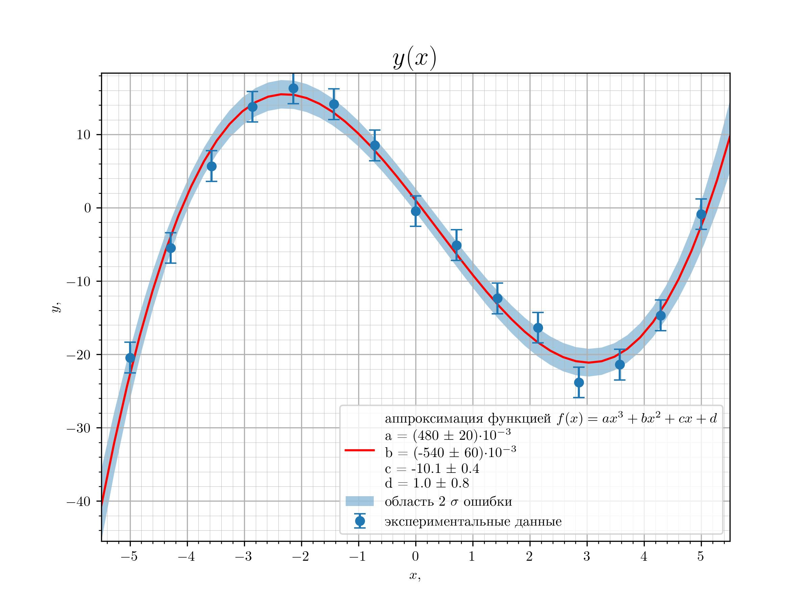
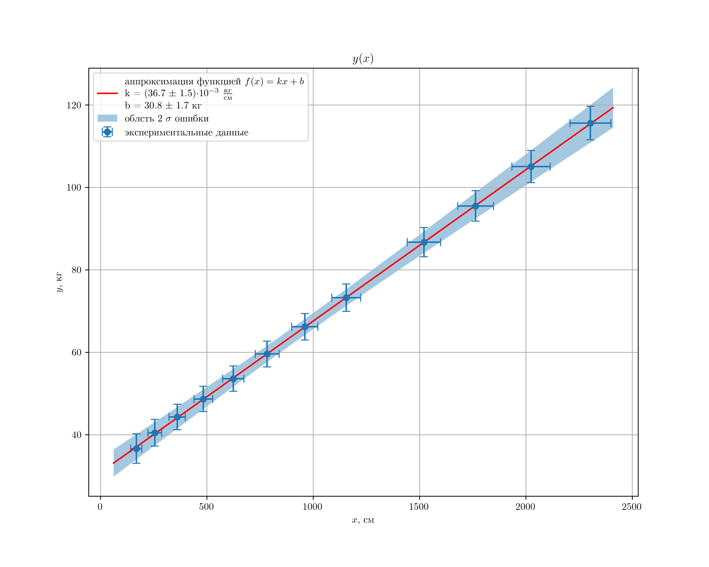
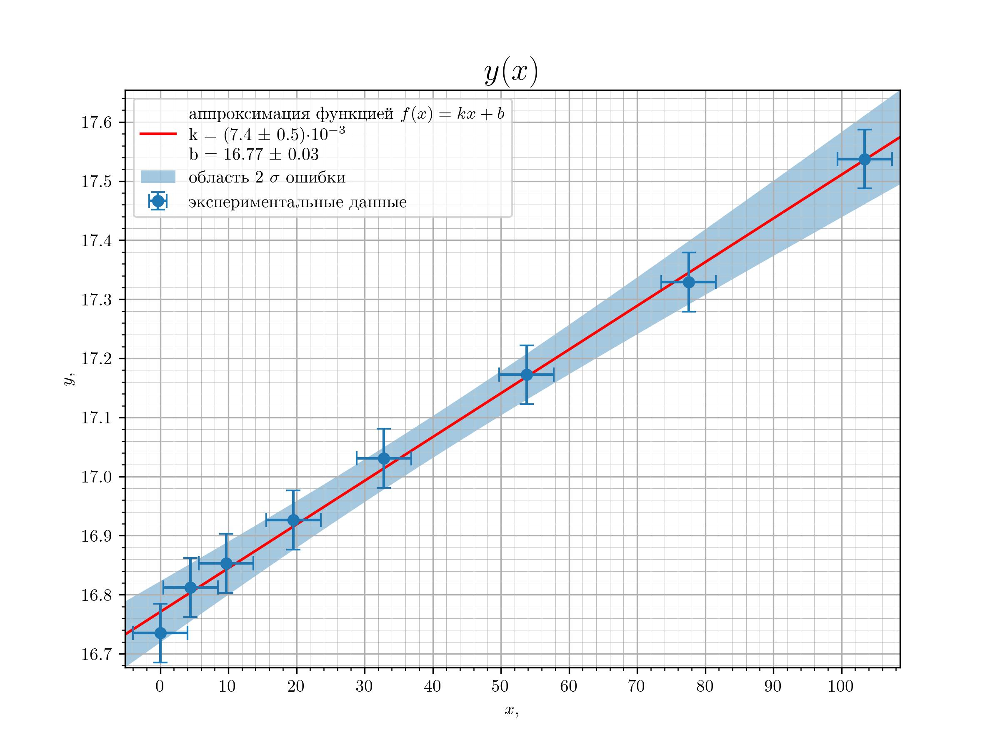

Physics Laboratory Data Analysis Templates
---
В этом репозитории содержатся примеры обработки и визуализации данных
для использования в качестве шаблонов. Предполагается использование данных физических экспериментов.

Акуальная верия шаблона **template2.ipynb**

Результат работы выглядит примерно так.


<!--  -->


Код делает следующее:
- наносит на график экспериментальные точки с крестами погрешности
- аппроксимирует данные произвольной зависимостью (при этом учитывается только погрешность данных по оси Y. Для аппроксимации
используется метод scopy.optimize.curve_fit)
- параметры аппроксимации с погрешностями и заданными пользователем размерностями отображаются в легенде. Количество 
значащих цифр подбирается автоматически в соответствии с общепринятыми требованиями.
- опционально: отображение доверительно области аппроксимации. В каждой точке с помощью матрицы ковариаций вычисляется
погрешность аппросимации. Подробнее про обосование вычислений можно прочитать в [мануале](manual/main.pdf) к этому 
проекту в части "Погрешность функции от зависимых переменных"

В папке [examples](examples) есть примеры использования шаблона с загрузкой данных из таблицы excel

[//]: # (![alt text]&#40;https://github.com/Hacker1337/LabDataTemplates/blob/master/examples/img/облась_ошибки_линейная.png?raw=true&#41;)

## Installation and Launching
Необходимые python библиотеки указаны в **requirements.txt**. Также для отрисовки по умолчанию используется **latex**. Если он не установлен, надо либо установить его, либо убрать строчку из преамбулы кода

```
    "text.usetex" : True,
```